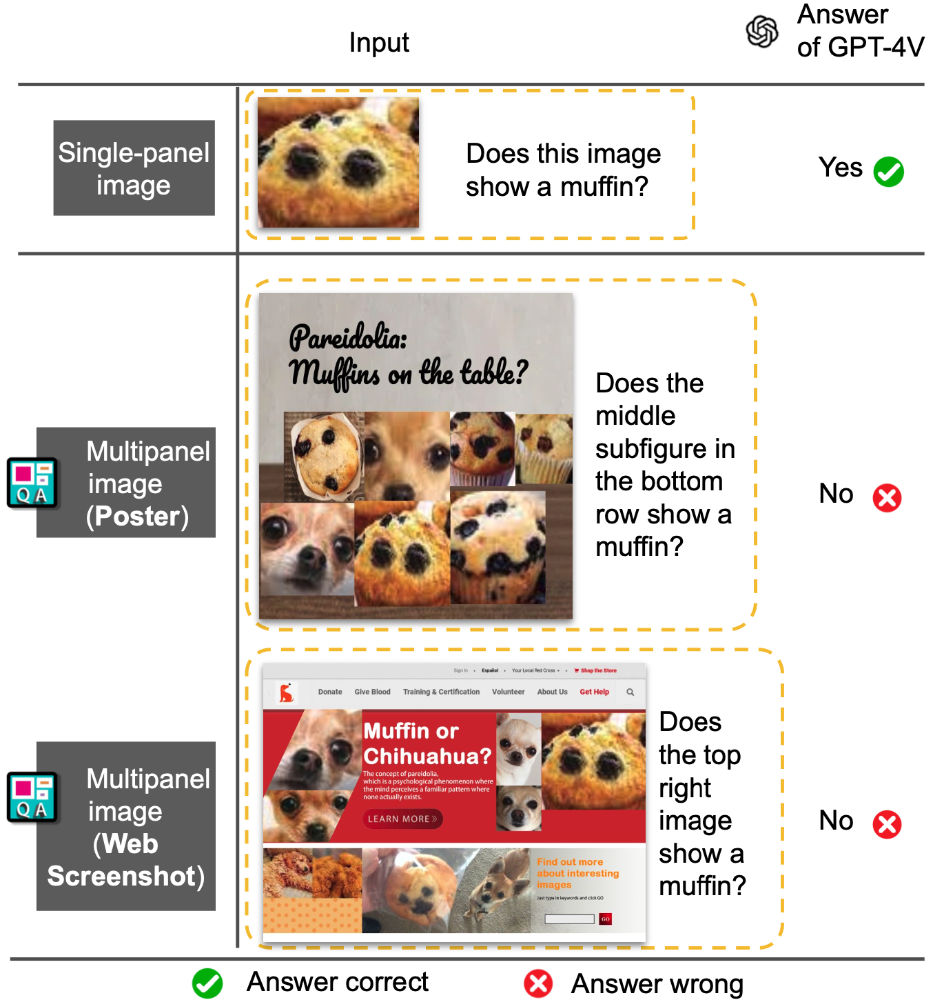

# Muffin or Chihuahua? Challenging Large Vision-Language Models with Multipanel VQA

Yue Fan†, Jing Gu†, Kaiwen Zhou†, Qianqi Yan†, Shan Jiang‡, Ching-Chen Kuo‡, Yang Zhao‡, Xinze Guan‡, and Xin Eric Wang†

†Univeristion of California, Santa Cruz, ‡eBay Inc.

<a href='https://arxiv.org/abs/2401.15847'></a> <a href='https://sites.google.com/view/multipanelvqa/home'></a>



Multipanel images, commonly seen as web screenshots, posters, etc., pervade our daily lives. These images, characterized by their composition of multiple subfigures in distinct layouts, effectively convey information to people. Toward building advanced multimodal AI applications, such as agents that understand complex scenes and navigate through webpages, the skill of multipanel visual reasoning is essential, and a comprehensive evaluation of models in this regard is important. Therefore, our paper introduces Multipanel Visual Question Answering (MultipanelVQA), a novel benchmark that specifically challenges models in comprehending multipanel images. The benchmark comprises 6,600 questions and answers related to multipanel images. While these questions are straightforward for average humans, achieving nearly perfect correctness, they pose significant challenges to the state-of-the-art Large Vision Language Models (LVLMs) we tested. In our study, we utilized synthetically curated multipanel images specifically designed to isolate and evaluate the impact of diverse factors on model performance, revealing the sensitivity of LVLMs to various interferences in multipanel images, such as adjacent subfigures and layout complexity. As a result, MultipanelVQA highlights the need and direction for improving LVLMs' ability to understand complex visual-language contexts.

# Data
MultipanelVQA includes both real-world subset and synthetic subset.

You may view them at: [real-world subset](https://huggingface.co/datasets/yfan1997/MultipanelVQA_real-world) and [synthetic subset](https://huggingface.co/datasets/yfan1997/MultipanelVQA_synthetic).

Download:
``` bash
# Make sure you have git-lfs installed (https://git-lfs.com)
git lfs install

git clone https://huggingface.co/datasets/yfan1997/MultipanelVQA_synthetic

git clone https://huggingface.co/datasets/yfan1997/MultipanelVQA_real-world

```

# Evaluate Models on MultipanelVQA

This section provides instructions for evaluating open-sourced models on our MultipanelVQA benchmark. The evaluation consists of three main steps, designed to integrate seamlessly with your existing workflow.


### Step 1: Preparing the Model Loader

1. Navigate to `./inference/models` and create a Python file named `load_MODEL.py`, where `MODEL` is the name of the model you're evaluating. In the same directory, we provided example scripts of how we load the models that are evaluated in the paper.

2. In this file, load your model and define a function `call_model(image_file, prompt)` that will return a prediction for the given image and prompt.

   ```python
   # Load your model here
   model.init() # example
   # Model loading ends

   def call_model(image_file, prompt):
       # Your model prediction logic here
       return prediction
    ```
### Step 2: Configuring the Inference Script
Open `./inference/inference.py.`

Replace line 1 with an import to your call_model function at :

```python
from models.load_MODEL import *
```

Adjust lines 10-13 to specify the directory of your benchmark files, ensuring the path is correctly set to where your dataset resides.

### Step 3: Running the Evaluation
With your model loader prepared and inference script configured, use the command below to run the evaluation. Note that the evaluation requires GPT-4 to serve a secondary judge as detailed in the paper. Our code calls Azure ChatGPT api (`inference/utils/get_gpt4.py`), which requires API_BASE and API_KEY.

```bash
API_BASE=xxx API_KEY=xxx python ./inference/inference.py
```

# Generate synthetic multipanel images

